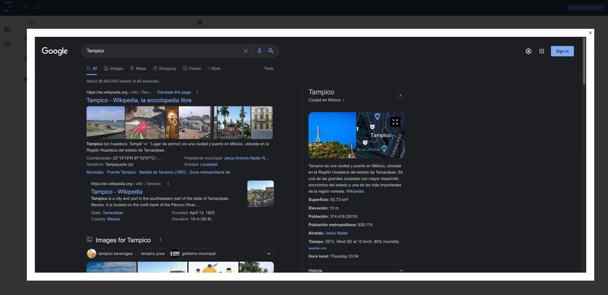

# Automation framework made with C# + Selenium

The goal of this project was to put into practice my knowledge of *Selenium* using *C#*.

## The project 💻

The **Automation Practice** store was automated using *C# + Selenium*.

## Tools ⚙️

* *C# v10.0.*
* *.NET Core v6.0.400.*
* *Microsoft .NET Test SDK v17.0.0.*
* *NUnit v3.13.2.-*
    * *NUnit 3 Test Adapter v4.0.0.*
* *Selenium.-*
    * *Selenium Support v3.141.0.*
    * *Selenium WebDriver v3.141.0.*
    * *Selenium WebDriver ChromeDriver v104.0.5112.7900.*
    * *Selenium WebDriver GeckoDriver v0.31.0.1.*
* *DotNetSeleniumExtras WaitHelpers v3.11.0.*
* *ExtentReports v4.1.0.*
* *Bogus v33.1.1.*
* *Serilog v2.11.0.-*
    * *Serilog Sinks Console v4.0.1.*
    * *Serilog Sinks File v5.0.0.*

## Project folder structure 🗂️

```bash
.
├── PageObjectModel/
│   ├── Components/
│   │   ├── Authentication
│   │   ├── CreateAccount
│   │   ├── Home
│   │   ├── MyAccount
│   │   ├── ShoppingCartAddress
│   │   ├── ShoppingCartOrderConfirmation
│   │   ├── ShoppingCartOrderSummaryBankwire
│   │   ├── ShoppingCartPaymentMethod
│   │   ├── ShoppingCartShipping
│   │   └── ShoppingCartSummary
│   ├── Models
│   ├── Pages
│   └── Utilities
└── Tests/
    ├── APIAndData
    ├── AutomationResources
    ├── Data
    ├── Models
    ├── Tests
    └── Utilities
```

## Setup 🛠️

I developed the code using a Mac, but it should work on a PC.

The following steps can be executed using a terminal (I use [hyper](https://hyper.is/)).

1. Clone the repo.-

```bash
> https://github.com/ArCiGo/CSharp-Automation-Framework.git

> git checkout SampleProject_1
```

2. Install the packages.-

```bash
> dotnet build
```

3. Don't forget to update the *Selenium WebDriver ChromeDriver* and the *Selenium WebDriver GeckoDriver*.

## Run the tests ⚡️

```bash
# Run all the tests
> dotnet test
```

```bash
# Running tests by category

# UI tests
> dotnet test --filter TestCategory=UI
```

When you execute the tests, a new folder is generated at the workspace root (**UIReports**). Inside of this folder, you are going to see the *index.html* report (you can open them using your favorite browser). Also, new log file is generated (*UIlogs-^.txt*) and you can open them using any text editor.




